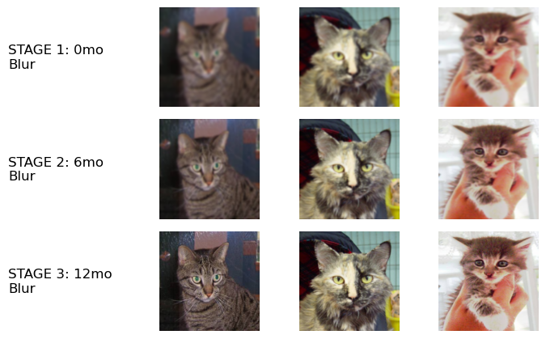
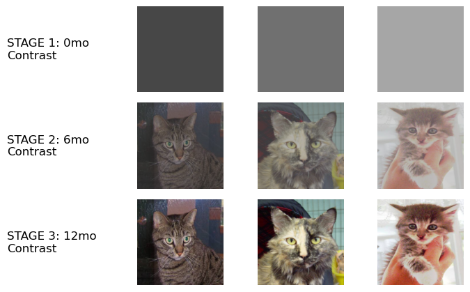
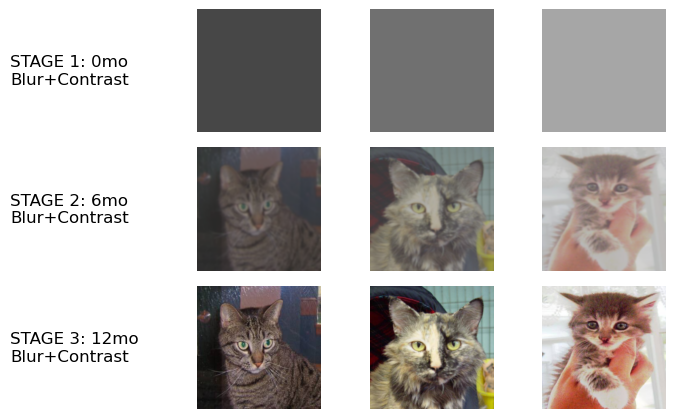
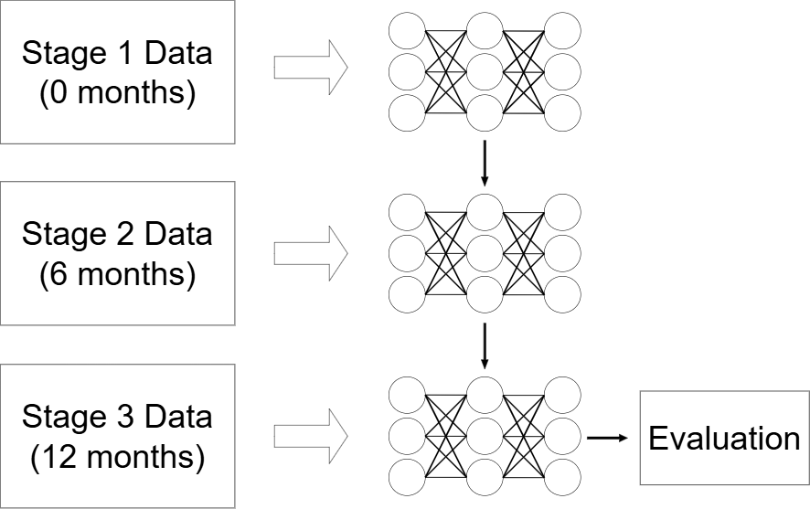
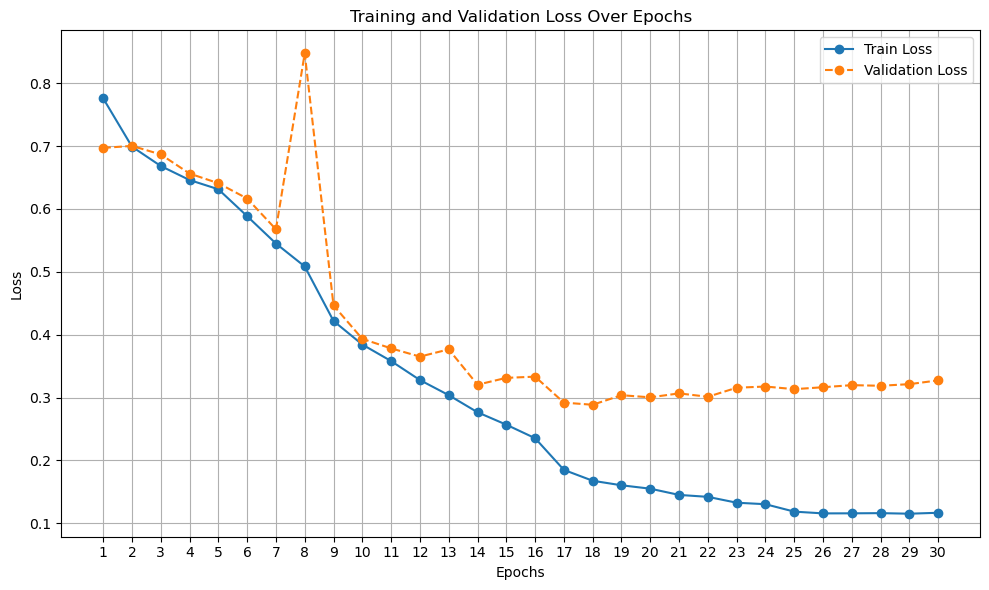
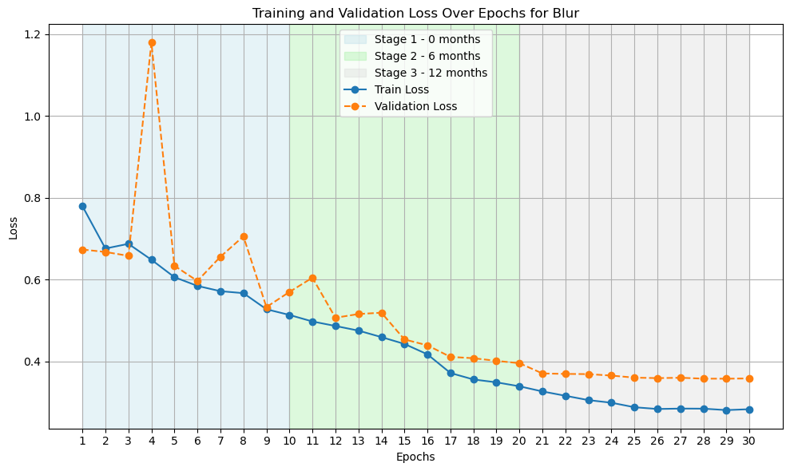
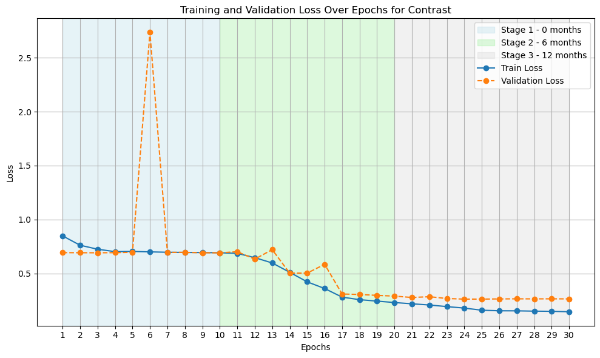
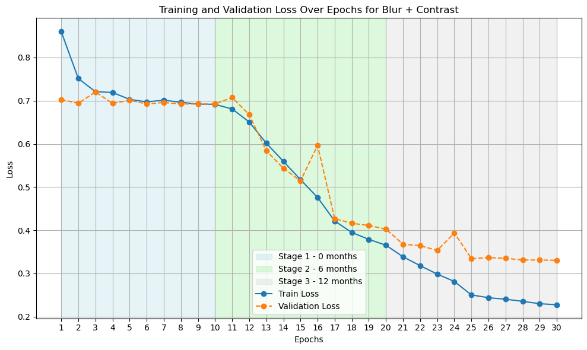

# infant-vision-simulation
This project simulates infant vision development using image transformations (Gaussian blur and contrast adjustment) based on the corresponding age in months, combined with curriculum-based learning strategies. A custom ResNet-18 model is trained from scratch to evaluate classification performance on transformed images (cats vs. dogs).

## Key Features
- **Simulation of Infant Visual Perception**:  
  Gaussian blur models reduced visual acuity, and contrast adjustment simulates changes in contrast sensitivity over developmental stages.
  
- **Curriculum-Based Training**:  
  Four training strategies corresponding to different transformation levels (ages in months: [0, 6, 12]) allow systematic exploration of developmental learning.

- **Custom ResNet-18 Model for Binary Classification**:  
  - Modified fully connected (FC) layer for two-class output.  
  - **No pre-trained weights**: All layers trained from scratch.  
  - **Dropout layer (50%)**: Added to reduce overfitting.  
  - **Input preprocessing**: Images resized to 224x224 pixels and normalized using ImageNet statistics.  

- **Training Optimization**:  
  - **Optimizer**: Adam with learning rate = 0.01, weight decay = 1e-4.  
  - **Loss Function**: Cross-entropy loss.  
  - **Learning Rate Scheduler**: Decreases by a factor of 10 every 8 epochs for better convergence.

## Key Accomplishments
| **Network** | **Transformation**      | **Train Loss** | **Val Loss** | **Train Accuracy** | **Val Accuracy** |
|-------------|-------------------------|----------------|--------------|-------------------|------------------|
| 1           | None                    | 0.1167         | 0.3273       | 95.74%            | 88.84%           |
| 2           | Gaussian blur           | 0.2831         | 0.3583       | 88.17%            | 84.46%           |
| 3           | Contrast adjustment     | 0.1457         | 0.2645       | 94.58%            | 89.76%           |
| 4           | Both transformations    | 0.2275         | 0.3304       | 90.97%            | 85.88%           |

## Visual Overview
### Curriculum and Sample Images

- **Sample images from different curriculum networks**  
    
  *Sample images for Network 2 with Gaussian blur transformation*  

    
  *Sample images for Network 3 with contrast adjustment*  

    
  *Sample images for Network 4 with both Gaussian blur and contrast adjustment*

- **Training Curriculum Overview**  
  

### Learning Curves
- **No Transformation**  
  
- **Gaussian Blur**  
  
- **Contrast Adjustment**  
  
- **Both Transformations**  
  

## References
1. He, K. et al. "Deep Residual Learning for Image Recognition." arXiv:1512.03385, 2015. [Link](https://arxiv.org/abs/1512.03385)  
2. Dhiren, S. (2021). *Cats vs Dogs Dataset*. Kaggle. [Link](https://www.kaggle.com/datasets/dhirensk/cats-vs-dogs-training8000test2000)  
3. Sheybani, S. et al. "Curriculum Learning with Infant Egocentric Videos." Indiana University, 2024. [Link](https://cogdev.lab.indiana.edu/research/curriculum_learning_with_infant_egocentric_videos.pdf)


## Install
Clone repo and install [requirements.txt](./requirements.txt) in a Python>=3.8.0 environment, including PyTorch>=1.8.

```
git clone https://github.com/hungdothanh/infant-vision-simulation.git  
cd infant-vision-simulation
pip install -r requirements.txt 
```

## Setup
Modify the correct directory path to the training set and validation set folder defined in the data/data.yaml

## Train
The following command executes training.
```
python train.py --data 'data/data.yaml' --age '0,30,60' --blur --epochs 10 --batch_size 64 --lr 0.01 --name 'cirriculum1-blur'
```
